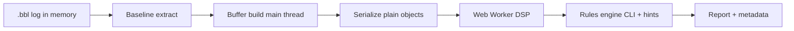

# Reliability and industry-style quality

How Auto Diagnostics works in production-minded terms, and how it is hardened toward commercial / enterprise standards (UAV ops, OEM tuning labs, fleet support).

## How the pipeline works

| Stage | Where | Purpose |
|-------|--------|---------|
| Baseline | Main thread | Channels, rate, header config, log quality |
| Buffer build | Main thread (yielding + progress/ETA) | Downsampled gyro/setpoint/motor arrays |
| Serialize | Main thread | Strip Vue proxies; validate before `postMessage` |
| Worker | Isolated thread (fresh per run by default) | FFT, step response, motor health |
| Rules | Main thread | Conservative CLI whitelist + directional hints |
| Metadata | Main thread | Confidence tier, build hash, timestamp, export |

Nothing runs on a server — **client-only**, same as Blackbox Explorer. In commercial settings this maps to **edge analysis** (no log upload required), which helps ITAR/privacy and field use.

## Reliability methods (implemented)

| Method | Module / location |
|--------|-------------------|
| Structured-clone safe payload | `worker_serialization.js` |
| Pre-flight validation | `analysis_reliability.js` → `validateWorkerPayload` |
| Worker retry (2×) + terminate on failure | `diagnostics_runner.js` |
| Fresh worker per analysis (default) | `feature_flags.js` → `freshWorkerPerRun` |
| Timeout + cancel | `diagnostics_runner.js` (45s) |
| Graded confidence | `buildAnalysisMetadata` |
| Persisted craft prefs | `localStorage` `bf_auto_diagnostics_prefs` |
| Golden regression suite | `test/fixtures/golden/` + `test/unit/golden_regression.test.js` |
| Property / fuzz tests | `fuzz_cli_parser.test.js`, `fuzz_worker_payload.test.js` |
| JSON Schema contract | `docs/schemas/auto-diagnostics-report.schema.json` |
| Runtime structure check | `schema_validate.js` |
| Feature flags (OEM kill-switch) | `feature_flags.js` — URL `?bf_diag=0`, localStorage |
| Opt-in telemetry (local-only) | `telemetry.js` — export JSON, no upload |
| Human-in-the-loop CLI gate | Bench verification checkbox before Copy CLI |
| Build provenance in reports | `build_info.js` — `buildHash`, `toolVersion`, `buildTime` |
| Progress + ETA during extract | `buildAnalysisBuffersAsync` → UI progress bar |
| Unit tests + CI | 30 Vitest tests, `.github/workflows/test.yml` |

## Feature flags

| Flag | Default | Override |
|------|---------|----------|
| `diagnosticsEnabled` | `true` | `?bf_diag=0` or localStorage `bf_diagnostics_flags` |
| `freshWorkerPerRun` | `true` | `?bf_diag_fresh=0` |
| `requireBenchVerificationForCli` | `true` | `?bf_diag_bench=0` |
| `telemetryOptIn` | `false` | `?bf_diag_telemetry=1` or panel toggle |

## Export schema

Reports export as JSON with:

- `schemaVersion`: `1`
- `schemaId`: URL to `docs/schemas/auto-diagnostics-report.schema.json`
- `toolVersion`, `buildHash`, `buildTime`
- Nested `report` object validated in CI against JSON Schema

## Commercial deployment patterns

| Pattern | Description |
|---------|-------------|
| **Embedded in Explorer** | Upstream PR — one toolbar button, standard modal |
| **Batch CLI** | SDK/Node worker batching `.bbl` folders; attach JSON exports |
| **Fleet portal** | Upload JSON exports only; logs stay local |
| **R&D lab** | Explorer + Diagnostics → JSON attached to test tickets |

## Upstream contribution (peer review)

Algorithm and UI land via stacked PRs to [betaflight/blackbox-log-viewer](https://github.com/betaflight/blackbox-log-viewer). See [UPSTREAM_INTEGRATION.md](./UPSTREAM_INTEGRATION.md) and [PR_SPLIT.md](./PR_SPLIT.md).

## What “commercial grade” does *not* mean

- Not certifying flightworthiness (no DO-178C / ISO claim).
- Not replacing human tune or prop mechanical inspection.
- Not auto-applying FC settings without bench verification.

Advisory analytics with **confidence tiers**, **audit exports**, **regression tests**, and **safety interlocks** is the industry-typical bar for internal fleet tools.
